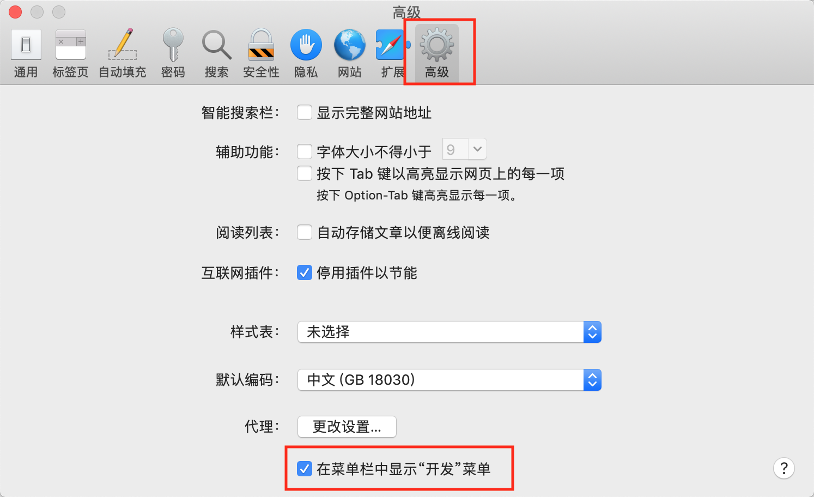

# 各个浏览器调试错误工具

> JavaScript高级程序设计，第17章
## IE调试错误

## Firefox

## Safari的开发菜单

* 开启方法
1. 运行Safari,点击“Safari”菜单下面的“偏好设置（Preferences...）”，切换到“高级选项（Advanced）”：
勾选在菜单栏中显示开发菜单
    

2. 勾选“在菜单栏显示"开发"菜单（ShowDevelop menu in menu bar）”，关闭偏好设置。此时在Safari的工具栏出现“开发（Develop）”菜单：

    

## Opera

# 错误处理

## try catch
```js
try {
  // 可能会导致错误的代码
  console.g('d')
} catch (err) {
  // 在错误发生时怎么处理
  console.log(err.name);
  console.log(err.message);
}
```

## finally子句

* 只要代码中包含了finally子句，无论是try或catch语句快中的return都将被忽略
```js
try{
}catch(err){
}finally{
}
```

## 错误类型
* 执行代码期间可能会发生的错误类型有多种类型。每种错误都有对应的错误类型。而当错误发生时，就会抛出相应类型的错误对象。ECMA-262定义了下列7中错误类型：

1. Error  // 基类型，其他错误类型都继承自该类型。因此所有错误类型共享一组相同的属性。Error类型的错误很少见，如果有，也是浏览器抛出的；这个基类型的主要目的是供开发人员抛出自定义错误。
2. EvalError  // 在 eval 函数发生异常时抛出。可能性小：没有把eval当作函数调用，会抛错。
3. RangeError // 数组超出相应范围时触发，经常出现这种错误。例：定义数组时，指定例不支持的项数(如 -20 或者Number.MAX_VALUE)，就会触发 new Array(-20) , newArray(Number.MAX_VALUE)
4. ReferenceError  // 引用错误，通常在访问不存在的变量时，会发生这种错误如 var obj = x；
5. SyntaxError  // 语法错误，把语法错误的JavaScript字符串传入 eval()函数时，就会导致此类错误。不常出现
6. TypeError  // 类型错误，在变量中保存着意外的类型时，或者在访问不存在的方法时，都会导致这种错误例：var o = new 10; alert('name' in true)
7. URIError // 在使用 encodeURI() 或 decodeURI()，而URI 格式不正确时 ，错误很少见，因为这两个函数容错性高


## 抛出错误

throw 操作符，用于随时抛出自定义错误。抛出错误时，必须要给 throw 操作符指定一个值，这个值是什么类型，没有要求。下列代码都是有效的

```js
throw 12345
throw 'hello world'
throw true;
throw {name: 'javascript'}
```

在遇到 throw 操作符时，代码会立即停止执行。仅当有 try-catch 语句捕获到被抛出的值时，代码才会执行

通过使用某种内置错误类型，可以更真是的模拟浏览器错误。每种错误类型的构造函数接收一个参数，即实际的错误消息。下面例子

```js
throw new Error('Something bad happened');
```

利用原型链还可以通过继承 Error 来创建自定义错误类型。此时需要为新创建的类型指定 name 和 message 属性

```js
function InvalidUrlError(message) {
    this.name = 'InvalidUrlError';
    this.message = message;
}
InvalidUrlError.prototype = new Error();

throw new InvalidUrlError('参数错误：404')

```

*IE只有在抛出 Error 对象时，才会显示自定义错误消息。对于其他类型，它都无一例外都显示"exception thrown and not caught"（抛出了一场，且未被捕获）*

* 我们只应该捕获那些你确切的知道该如何处理的错误。`捕获错误`的目的在于避免浏览器以默认方式处理它们，而`抛出错误`的目的在于提供错误发生具体原因的消息。

## 错误（error）事件

任何没有通过 try-catch 处理的错误都会触发 window 对象的 error 事件。IE,Firefox ,Chrome 保持向后兼容，并没有对这个事件作任何修改（Opera 和 Safari 不支持 error 事件）

```js
window.onerror = function (message, url, line) {
    // 错误消息、错误所在url、错误所在第行号
    alert(message);
    return false; // 可以阻止浏览器默认行为
}
```
 图像也支持 error 事件。只要图像的 src 特性中的 URL 不能返回可以被识别的图像格式，就会触发 error 事件。此时的 error 事件遵循 DOM 格式，会返回一个以图像为目标的 event 对象。

```js
var image = new Image();
EventUtil.addHandler(image, 'load', function (event) {
    alert('Image loaded!')
})
EventUtil.addHandler(image, 'error', function (event) {
    alert('Image not loaded!')
})

image.src= 'smilex.gif'
```

## 处理错误策略

例如；记录和监控系统。这些攻击的用途在于分析错误模式，追查错误原因，同时帮助确定错误会影响多少用户。

## 常见的错误类型

* 类型转换错误
* 数据类型错误
* 通信错误

### 类型转换错误

类型转换错误发生在使用某个操作符，或者使用其他可能会自动转换值的数据类型的语言结构时，在使用相等（==）和不相等（！=）操作符，或者在if、for及 while 等流控制语句中使用非布尔值时，最常发生类型转换错误。

建议使用全等，if中建议使用typeof 而不是直接if(value){}

### 数据类型错误

JavaScript 是松散类型的，也就是说，在使用变量和函数参数之前，不会对它们进行比较以确保它们对数据类型正确。为了保证不会发生数据类型错误，只能依靠开发人员便携适当的数据类型检测代码。在将预料之外的值传递给函数的情况下，最容易发生数据类型错误。

大体来说，基本类型的值应该使用 typeof 来检测，而对象的值则应该使用 instanceof 来检测。根据使用函数的方式，有时候并不需要逐个检测所有参数的数据类型。但是，面向公众的 API 则必须无条件地执行类型检查，以确保函数能够正常的执行。

### 通信错误

* 对于查询字符串不使用 encodeURIComponent();
* 在服务器响应的数据不正确。动态加载脚本和动态加载样式，运用两种技术都有可能遇到资源不可用的情况。在某些情况下，使用 ajax 通信可以提供有关错误状态的更多信息。
对于查询字符串，必须使用 encodeURIComponent() 方法，为了确保，可以定义一个处理查询字符串的函数

```js
function addQueryString(url, name, value) {
    if (url.index('?') === -1) {
        url += '?'
    } else {
        url += '&'
    }
    url += encodeURIComponent(name) + '=' + encodeURIComponent(value);
    return url;
}
```

### 区分致命错误和非致命错误

* 非致命错误
1. 不影响用户的主要任务；
2. 只影响页面的一部分
3. 可以恢复
4. 重复相同操作可以消除错误

* 致命错误 比如for循环里可以增加 try-catch 语句
1. 应用程序根本无法继续运行
2. 错误明显影响了用户的主要操作
3. 会导致其他连带错误

### 把错误记录到服务器

开发 web 应用程序过程中的一种常见的做法，就是集中保存错误日志，以便查找重要错误的原因

```js
function logError(sev, msg) {
    // 表示验证程度的数值或字符串及错误的消息
    var img = new Image();
    img.src = 'log.php?sev=' + encodeURIComponent(sev) + '&msg=' + encodeURIComponent(msg);
}
```

这样做的好处：
1. 所有浏览器都支持 Image 对象，包括那些不支持 XMLHTTPRequest 对象的浏览器。
2. 可以避免跨域限制。通常都是一台服务器处理多台服务器的错误，而这种情况下使用 XMLHTTPRequest 是不行的
3. 在记录错误的过程中，出问题的概率比较低

只要是使用 try-catch 语句，就应该把相应的错误记录到日志中。来看下面的例子。

```js
for (var i = 0, len = node.length; i < len; i++) {
    try{}
    catch(err) {
        logError('nonfatal(非致命)', 'module init failed:' + error.message);
    }
}
```

## 调试技术

### 将消息记录到控制台

* error
* info
* log
* warn

Opera 10.5 之前的版本中，JavaScript 控制台可以通过 `opera.postError()` 方法来访问，接收一个参数;

### 将消息记录到当前页面
* 这种技术在不支持 JavaScript 控制台到 IE7 及更早版本或其他浏览器中十分有用

```js
function log(message) {
    var console = document.getElementById('debuginfo');
    if (console === null) {
      console = document.createElement('div');
      console.id = 'debuginfo';
      console.style.background = 'red';
      document.body.appendChild(console)
    }
    console.innerText += '<p>' + message + '</p>'
  }
```

### 抛出错误

抛出错误也是一种调试代码的好办法。如果错误消息很具体，基本就可以把它当作确定错误来源的依据
```js
function assert(condition, message) {
    if (!condition) {
      throw new Error(message)
    }
  }
  function divide(num1, num2) {
    assert(typeof num1 == 'number' && typeof num2 == 'number', 'divide(): both arguments must be numbers.')
    return num1 / num2
  }
```

## 常见的 IE 错误

### 操作终止
当 `<script>` 节点被包含在某个元素中，而且 JavaScript 代码又要使用 appendChild()，innerHTML 或其他 DOM 方法修改该元素的父元素或祖先元素时，将会发生操作终止错误（因为只能修改已经加载完毕的元素）
```html
<body>
    <div>
        <script type="text/javascript">
          document.body.appendChild(document.createElement('div'))</script>
        <script>
    </div>
</body>
```

要避免这个问题，可以等到目标元素加载完毕后再对他进行操作，或者使用其他操作方法。例如， 为document.body 添加一个绝对定位在页面上的覆盖层，就是一种非常常见的操作。因此上面的例子可以使用 insertBefore
```js
document.body.insertBefore(document.createElement('div'), document.body.firstChild);
```
除了改变方法之外，还可以把 `<script>` 元素从包含元素中移出来，直接作为`<body>` 的子元素。


### 无效字符

根据语法，JavaScript 文件必须只包含特定的字符。在JavaScript 文件中存在无效字符时， IE会抛出无效字符( invalid character )错误。所谓无效字符，就是JavaScript语法中未定义的字符。例如，有一个很像减号但却由Unicode 值8211 表示的字符( \u2013 )，就不能用作常规的减号( ASCII 编码为45 ),因为JavaScript 语法中没有定义该字符。这个字符通常是在Word 文档中自动插入的。如果你的代码是从Word 文档中复制到文本编辑器中，然后又在IE 中运行的，那么就可能会遇到无效字符错误。其他浏览器对无效字符做出的反应与IE类似，Firefox会抛出非法字符（iIlegal character） 错误，Safari会报告发生了语法错误，而Opera 则会报告发生了ReferenceError （引用错误）。因为它会将无效字符解释为未定义的标识符。


### 未找到成员
IE中的所有DOM对象都是以COM 对象，而非原生JavaScript对象的形式实现的。这会导致一些与垃圾收集相关的非常奇怪的行为。IE中的未找到成员( Member not found )错误，就是由于垃圾收集例程配合错误所直接导致的。

具体来说，如果在对象被销毁之后，又给该对象赋值，就会导致未找到成员错误。而导致这个错误的，一定是COM 对象。发生这个错误的最常见情形是使用event 对象的时候。IE中的event对象是window的属性，该对象在事件发生时创建，在最后一个事件处理程序执行完毕后销毁。假设你在一个闭包中使用了event 对象，而该闭包不会立即执行，那么在将来调用它并给event 的属性赋值时，就会导致未找到成员错误，如下面的例子所示。

```js
document.onclick = function () {
  var event = window.event;
  setTimeout(function (){
    event.returnValue = false; //未找到成员错误
  }, 1000);
};
```
在这段代码中，我们将一个单击事件处理程序指定给了文档。在事件处理程序中，window.event被保存在event 变量中。然后，传人setTimeout()中的闭包里又包含了event变量。当单击事件处理程序执行完毕后，event 对象就会被销毁，因而闭包中引用对象的成员就成了不存在的了。换句话说，由于不能在COM对象被销毁之后再给其成员赋值，在闭包中给returnValue 赋值就会导致未找到成员错误。

### 未知运行时错误

当使用innerHTML或outerHTML以下列方式指定HTML时，就会发生未知运行时错误( Unknown runtime error )：一是把块元素插入到行内元素时， 二是访问表格任意部分( table 、 tbody等)的任意属性时。例如，从技术角度说，span标签不能包含div之类的块级元素，因此下面的代码就会导致未知运行时错误：
```html
span.innerHTML = "div Hi /div";  //这里，span包含了div元素
```
在遇到把块级元素插入到不恰当位置的情况时，其他浏览器会尝试纠正并隐藏错误，而IE在这一点上反倒很较真儿。


### 语法错误

通常，只要IE一报告发生了语法错误( syntax error )，都可以很快找到错误的原因。这时候，原因可能是代码中少了一个分号，或者花括号前后不对应。然而，还有一种原因不十分明显的情况需要格外注意。

如果你引用了外部的 JavaScript 文件，而该文件最终并没有返回JavaScript代码，IE也会抛出语法错误。例如，script元素的src特性指向了一个HTML文件，就会导致语法错误。报告语法错误的位置时，通常都会说该错误位于脚本第一行的第一个字符处。Opera 和Safari 也会报告语法错误，但它们会给出导致问题的外部文件的信息；IE就不会给出这个信息，因此就需要我们自己重复检查一遍引用的外部JavaScript文件。但Firefox会忽略那些被当作JavaScript 内容嵌入到文档中的非JavaScript文件中的解析错误。

在服务器端组件动态生成 JavaScript 的情况下，比较容易出现这种错误。很多服务器端语言都会在发生运行错误时，向输出中插入HTML代码，而这种包含HTML的输出很容易就会违反JavaScript语法。如果在追查语法错误时遇到了麻烦，我们建议你再仔细检查一遍引用的外部文件，确保这些文件中没有包含服务器因错误而插入到其中的HTML。

### 系统无法找到指定资源
系统无法找到指定资源(The system cannot locate the resource specified )这种说法，恐陷要算是IE给出的最有价值的错误消息了。在使用JavaScript 请求某个资源URL ，而该URL的长度超过了IE 对URL最长不能超过2083个字符的限制时，就会发生这个错误。IE不仅限制JavaScript中使用的URL的长度，而且也限制用户在浏览器自身中使用的URL长度（其他浏览器对URL 的限制没有这么严格）。IE 对URL路径还有一个不能超过2048个字符的限制。下面的代码将会导致错误。

```js
function createLongUrl(url){
  var s = "?";
  for (var i=0, len= 2500; i < len; i++){
    s += "a" ;
  }
  return url + s;
}

var x = new XMLHttpRequest( );
x.open("get", createLongUrl("http://www.somedomain.com/"), true);
x.send(null);
```
在这个例子中，XMLHttpRequest对象试图向一个超出最大长度限制的URL发送请求。在调用open()方法时，就会发生错误。避免这个问题的办法，无非就是通过给查询字符参数起更短的名字，或者减少不必要的数据，来缩短查询字符串的长度。另外，还可以把请求方法改为POST，通过请求体而不是查询字符串来发送数据。


## 总结几种避免浏览器相应JavaScript错误的方法

1.在可能发生错误的地方使用try-catch语句，这样你还有机会以适当的方式对错误给出响应，而不必沿用浏览器处理错误的机制。

2.使用window.onerror事件处理程序，这种方式可以接受try-catch不能处理的所有错误（仅限于IE、Firefox和Chrime）。

对任何Web应用程序都应该分析可能发生的错误来源，并制定处理错误的方案。

（1）首先必须明确什么是致命错误，什么是非致命错误

（2）其次，再分析代码，以判断最可能发生的错误。JavaScript中发生错误的主要原因：

1. 类型转换

2. 未充分检测数据类型（数据类型错误）

3. 发送给服务器或从服务器接收的数据有错误（通信错误）


