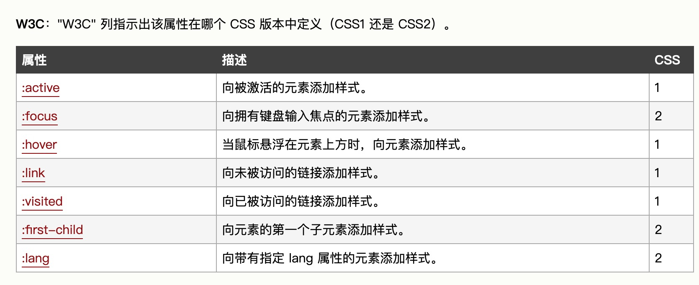
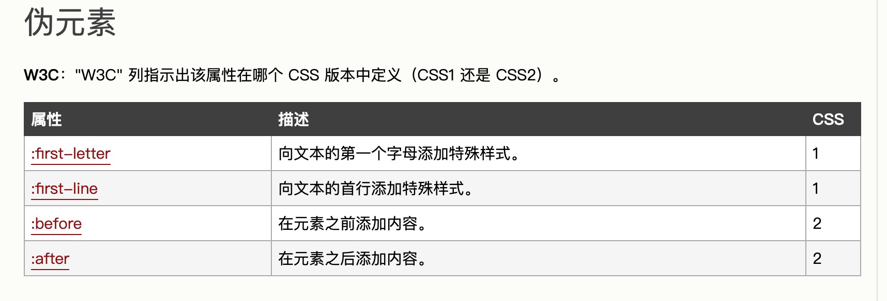

# 经常遇到的css问题
## 超过宽度，显示...
* 超出一行，显示..., 需指定宽度
  ```css
  overflow {
    overflow: hidden;
    text-overflow: ellipsis;
    white-space: nowrap;
    display: block;
    width: 100%;
  }
  ```
* 超出两行，显示...，需指定宽度
```css
overflow2 {
  overflow: hidden;
  text-overflow: ellipsis;
  display: -webkit-box;
  -webkit-line-clamp: 2;
  -webkit-box-orient: vertical;
}
```
所遇问题
> -webkit-box-orient: vertical 在使用 webpack 打包的时候这段代码会被删除掉，原因是 optimize-css-assets-webpack-plugin 这个插件的问题。

```css
    /*! autoprefixer: off */
    -webkit-box-orient: vertical;
    /* autoprefixer: on */
```

## 两端对齐

```
div {
    margin: 10px 0;
    width: 100px;
    border: 1px solid red;
    text-align: justify;
    text-align-last:justify;
    -moz-text-align-last: right; /* 针对 Firefox 的代码 */
}
div:after{
    content: '';
    display: inline-block;
    width: 100%;
}


```
## table的td里换行问题
* 描述： table的td里如果是比较长的数字，会影响样式，不会换行，所以需要加强制换行，兼容浏览器换行
```css
td {
  -ms-word-break: break-all;    // ie
  word-break:break-all;         // ff
  word-break: break-word;       // chrome
}
```

## 伪类和伪元素





## 充分利用 + 选择器
* 第二个、第三个li加粗 当除了第一个，其他子元素都有共同的样式时

```html
<ul>
    <li>List item 1</li>
    <li>List item 2</li>
    <li>List item 3</li>
  </ul>
```
```css
li + li {font-weight:bold;}
```

## 利用伪类实现三角形

```css
.sanjiao {
      position: relative;
      background-color: #666;
    }
    .sanjiao::after {
      position: absolute;
      content: '';
      width: 0;
      height: 0;
      border: 10px solid transparent;
      border-left: 10px solid red;
    }
```

## 清除浮动元素的方法

1. 外墙元素隔离法，新增clear标签  `.clear{ clear:both} `，在浮动元素的父元素外 ;
2. 内墙元素隔离法，在浮动元素父元素内
3. 利用伪类
```css
.clearfix:before, .clearfix:after {
  display: table;
  content: '';
  clear: both;
}
```
4. 父元素设置高度
5. 父元素定义 *overflow: hidden* 该属性相当于是让父级紧贴内容，这样即可紧贴其对象内内容（包括使用float的div盒子），从而实现了清除浮动。

6. 利用清除属性clear 浮动元素的父辈仍然没有高度,此时清除元素的margin-top失效
