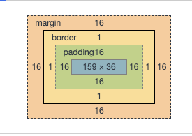

## 盒模型概述

* 在一个文档中，每个元素都被表示为一个矩形的盒子。确定尺寸，属性`像它的颜色，背景，边框方面`和这些盒子的位置是渲染引擎的目标。

* 在 CSS 中，使用标准盒模型描述这些矩形盒子中的每一个。这个模型描述了元素所占空间的内容。每个盒子有四个边：外边距边（margin）， 边框边（border），内填充边（padding）与内容（content）边。

    

### css元素分类
* 替换元素和不可替换元素：就元素本身的特点来讲，可以分为替换和不可替换元素

    1. 替换元素就是浏览器根据元素的标签和属性，来决定元素的具体显示内容

        例如：浏览器会根据\标签的src属性的值来读取图片信息并显示出来，而如果查看(X)HTML代码，则看不到图片的实际内容；

        又例如：根据\<input>标签的type属性来决定是显示输入框，还是单选按钮等。

         (X)HTML中的\、\<input>、\<textarea>、\<select>、\<object>都是替换元素。这些元素往往没有实际的内容，即是一个空元素，浏览器会根据元素的标签类型和属性来显示这些元素。可替换元素也在其显示中生成了框。
    2. 不可替换元素

        (X)HTML 的大多数元素是不可替换元素，即其内容直接表现给用户端（例如浏览器）。段落<p>是一个不可替换元素，文字“段落的内容”全被显示。

* 显示元素

    除了可替换元素和不可替换元素的分类方式外，CSS 2.1中元素还有另外的分类方式：块级元素（block-level）和行内元素（inline-level，也译作“内联”元素）。

   1. 块级元素

    通过CSS设定了浮动（float属性，可向左浮动或向右浮动）以及设定显示（display）属性为“block”或“list-item”的元素都是块级元素。

    但是浮动元素比较特殊，由于浮动，其旁边可能会有其他元素的存在。而“list-item”（列表项<li>），会在其前面生成圆点符号，或者数字序号。

    * 块级元素特点：自动换行，可设置高宽
    1. 每个块级元素都是独自占一行，其后的元素也只能另起一行，并不能两个元素共用一行。
    2. 元素的高度、宽度、行高和顶底边距都是可以设置的。　　
    3. 元素的宽度如果不设置的话，默认为父元素的宽度。

        常见的块级元素：
        ```
         <address>   <article> HTML5 <aside> HTML5 <audio> HTML5 <blockquote>  <canvas> HTML5

         <dd>  <div> <dl>  <fieldset>  <figcaption> HTML5  <figure> HTML5  <footer> HTML5  <form>

         <h1>,  <h2>,  <h3>, <h4>,  <h5>, <h6>

         <header>  HTML5  <hgroup> HTML5  <hr> <noscript>  <ol> <output> HTML5  <p> <pre>  <section> HTML5 <table>

         <tfoot>  <ul> <video>  HTML5
        ```
        \<blockquote>: HTML中的元素（或者 HTML 块级引用元素），代表其中的文字是引用内容。通常在渲染时，这部分的内容会有一定的缩进（注 中说明了如何更改）。若引文来源于网络，则可以将原内容的出处 URL 地址设置到 cite 特性上，若要以文本的形式告知读者引文的出处时，可以通过 <cite> 元素。

        \<output>HTML 标签定义一个用户的操作或者计算的结果。

        \<noscript> 标签 当某个script类型在浏览器中不受支持或者被关闭时作为替代的内容
        * h5中所有块级元素列表

        |名称|定义|备注|
        |----|:----|----|
        |\<address>|联系方式信息||
        |\<blockquote>|块引用||
        |\<dd>|定义列表中定义条目描述。||
        |\<dl>|定义列表。||
        |\<div>|文档分区。||
        |\<fieldset>|表单元素分组|表格会有边界，使用legend表示表单标题|
        |\<form>|表单。||
        |\<h1>, \<h2>, \<h3>, <br>\<h4>, \<h5>, \<h6>|标题级别||
        |\<hr>|水平分割线||
        |\<noscript>|不支持脚本或禁用脚本时显示的内容。||
        |\<ol>|有序列表。||
        |\<table>|表格||
        |\<tfoot>|表脚注||
        |\<ul>|无序列表||
        |\<p>|行||
        |\<pre>|预格式化文本||
        |\<article>|文章内容|HTML5|
        |\<aside>|伴随内容|HTML5|
        |\<audio>|音频播放|HTML5|
        |\<canvas>|绘制图形|HTML5|
        |\<figcaption>|图文信息组标题|HTML5|
        |\<figure>|图文信息组（参照figcaption）|HTML5|
        |\<footer>|区段尾或页尾|HTML5|
        |\<header>|区段头或页头。|HTML5|
        |\<hgroup> |标题组|HTML5|
        |\<output>|表单输出。|HTML5|
        |\<section>|一个页面区段|HTML5|
        |\<video>|视频|HTML5 |

    2. 行内元素

    display属性等于“inline”的元素都是行内元素。几乎所有的可替换元素都是行内元素，例如、<input>等等。

    不过元素的类型也不是固定的，通过设定CSS 的display属性，可以使行内元素变为块级元素，也可以让块级元素变为行内元素。

    * 行内元素特点：（无法自动换行，无法设置宽高）
    1. 可以和其他元素处于一行，不用必须另起一行。
    2. 元素的高度、宽度及顶部和底部边距不可设置。
    3. 元素的宽度就是它包含的文字、图片的宽度，不可改变。

      常见的行内元素：

    ```
    b, big,  i, small, tt

    abbr, acronym,  cite, code, dfn,  em, kbd, strong,  samp, var

    a, bdo,  br, img, map,  object,  q, script,  span, sub, sup

    button, input,  label, select, textarea
    ```

    * 行内元素分为行内替换元素，行内非替换元素

    * 行内替换元素

        width、 height、 margin的四个方向、 padding的四个方向都正常显示，遵循标准的css盒模型。 例如：img

    * 行内非替换元素

        width、 height不起作用，用line-height来控制高度。

        padding左右起作用，上下不会影响行高，但是对于有背景色和内边距的行内非替换元素，背景可以向元素上下延伸，但是行高没有改变。因此视觉效果就是与前面的行重叠。(《css权威指南》 P249)
        margin左右起作用，上下不起作用，原因在于：行内非替换元素的外边距不会改变一个元素的行高（《css权威指南》 P227）。

# 常见的布局方案
### 静态布局(Static Layout)
1. 布局概念：最传统、原始的Web布局设计。网页最外层容器(outer)有固定的大小,所有的内容以该容器为标准,超出宽高的部分用滚动条(overflow:scroll)来实现滚动查阅。

2. 优点：采用的是css2之前的写法,不需要考虑用户浏览器的宽度，不存在浏览器兼容性。布局简单。

3. 缺点：但是移动端不可以使用pc端的页面,两个页面的布局不一致,移动端需要自己另外设计一个布局并使用不同域名呈现。

4. 实现方法：PC端: 最外层居中,限制了最小的宽度, 低于了则以最小宽度出现滚动条，移动端限制了最大的宽度, 超过了则以最大宽度居中显示

### 流式布局(Liquid Layout)，也叫百分比布局

* 布局概念

流式布局的特点是随着屏幕的改变，页面的布局没有发生大的变化，可以进行适配调整，这个正好与自适应布局相补。
流式布局常用的设计模板:
  1. 左侧固定+右侧自适应
  2. 左右固定宽度+中间自适应(参考京东手机版)

  页面元素的宽度按照屏幕进行适配调整，主要的问题是如果屏幕尺度跨度太大，那么在相对其原始设计而言过小或过大的屏幕上不能正常显示 。 你看到的页面，元素的大小会变化而位置不会变化——这就导致如果屏幕太大或者太小都会导致元素无法正常显示。
* 优点

元素的宽高用百分比做单位，元素宽高按屏幕分辨率调整，布局不发生变化

* 缺点

屏幕尺度跨度过大的情况下，页面不能正常显示。

### 自适应布局

分别为不同的屏幕设置布局格式，当屏幕大小改变时，会出现不同的布局，意思就是在这个屏幕下这个元素块在这个地方，但是在那个屏幕下，这个元素块又会出现在那个地方。只是布局改变，元素不变。可以看成是不同屏幕下由多个静态布局组成的。


