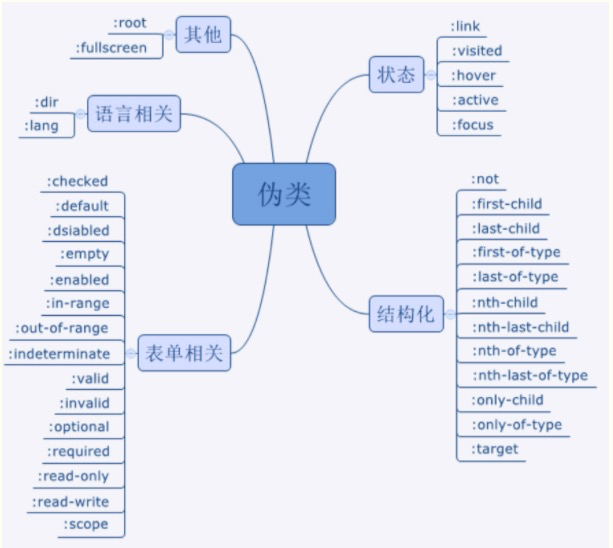
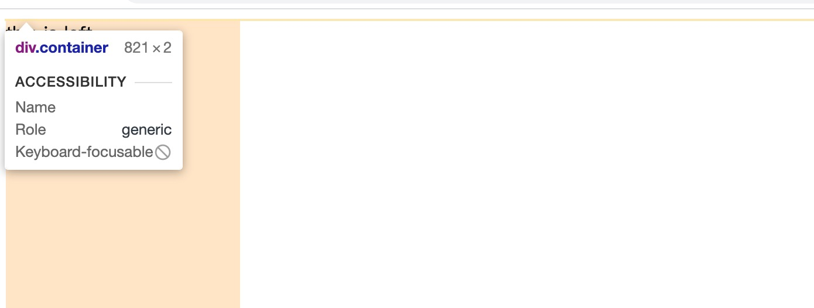

## 伪类与伪元素的特性及其区别

* 伪类本质上是为了弥补常规CSS选择器的不足，以便获取到更多信息；
* 伪元素本质上是创建了一个有内容的虚拟容器；

CSS3中伪类和伪元素的语法不同；  

伪类  `:link  :hover`         

伪元素  `::before    ::after`

可以同时使用多个伪类，而只能同时使用一个伪元素；

其中伪类和伪元素的根本区别在于：它们是否创造了新的元素,,   这个新创造的元素就叫  "伪无素" 。

伪元素/伪对象：不存在在DOM文档中，是虚拟的元素，是创建新元素。 这个新元素(伪元素)  是某个元素的子元素，这个子元素虽然在逻辑上存在，但却并不实际存在于文档树中.

伪类：存在DOM文档中，(无标签,找不到,  只有符合触发条件时才能看到 ),  逻辑上存在但在文档树中却无须标识的“幽灵”分类。

因为伪类是类似于添加类所以可以是多个，而伪元素在一个选择器中只能出现一次，并且只能出现在末尾 

W3C中对于二者应用的描述(描述太模糊, 不容易理解)：

伪类：用于向某些选择器添加特殊的效果
伪元素：用于将特殊的效果添加到某些选择器(标签
 
:after/::after和:before/::before的异同
 

* 相同点

都可以用来表示伪类对象，用来设置对象前的内容

:before和::before写法是等效的; :after和::after写法是等效的
不同点

:before/:after是Css2的写法，::before/::after是Css3的写法

所以css2的要比css3的兼容好    ,,  :before/:after 的兼容性要比::before/::after好 ， 
 

不过在H5开发中建议使用::before/::after比较好
注意：

伪对象要配合content属性一起使用

伪对象不会出现在DOM中，所以不能通过js来操作，仅仅是在 CSS 渲染层加入

伪对象的特效通常要使用:hover伪类样式来激活

eg:当鼠标移在span上时，span前插入”duang”
```html
<style>
 　　 span{
                background: yellow;
           }
           span:hover::before{
                content:"duang";
           }
  </style>
  
  <span>222</span>
```



## css选择器问题

:nth-child(n),n从1开始计数
:nth-child(odd)和:nth-child(even),从1开始计数
:nth-child(an+b),n从0开始计数

an+b的n表示从0开始计数，相加之后正常从1生效
```html
<style>
p:nth-child(3n+0) {
     color: red;
}
</style>
<body> 
 <p>this is </p>
 <p>this is </p>
 <p>this is red</p>
 <p>this is </p>
</body>

```
## 两个head里的css引用加载顺序
```html
<head>
     <link rel="stylesheet" href="main1.css">
     <link rel="stylesheet" href="main2.css">
</head>
```

* main1.css和main2.css同时开始加载，先加载完成的优先解析

* 如果main1.css和main2.css中有相同的选择器规则，那么main2.css中的规则将合并main1.css的规则

## 在W3C标准盒模型

标准盒子模型 ＝ margin + border + padding + width （width = content ）

IE盒子模型 ＝ margin + width（width = border + padding + content ）

## 什么是BFC?
### 常见定位方案
在讲 BFC 之前，我们先来了解一下常见的定位方案，定位方案是控制元素的布局，有三种常见方案:

* 普通流 (normal flow)
在普通流中，元素按照其在 HTML 中的先后位置至上而下布局，在这个过程中，行内元素水平排列，直到当行被占满然后换行，块级元素则会被渲染为完整的一个新行，除非另外指定，否则所有元素默认都是普通流定位，也可以说，普通流中元素的位置由该元素在 HTML 文档中的位置决定。
* 浮动 (float)
在浮动布局中，元素首先按照普通流的位置出现，然后根据浮动的方向尽可能的向左边或右边偏移，其效果与印刷排版中的文本环绕相似。
* 绝对定位 (absolute positioning)
在绝对定位布局中，元素会整体脱离普通流，因此绝对定位元素不会对其兄弟元素造成影响，而元素具体的位置由绝对定位的坐标决定。

### BFC 即 Block Formatting Contexts (块级格式化上下文)，它属于上述定位方案的普通流。

具有 BFC 特性的元素可以看作是隔离了的独立容器，容器里面的元素不会在布局上影响到外面的元素，并且 BFC 具有普通容器所没有的一些特性。

通俗一点来讲，可以把 BFC 理解为一个封闭的大箱子，箱子内部的元素无论如何翻江倒海，都不会影响到外部。

### 触发 BFC
只要元素满足下面任一条件即可触发 BFC 特性：

body 根元素

浮动元素：float 除 none 以外的值

绝对定位元素：position (absolute、fixed)

display 为 inline-block、table-cells、flex

overflow 除了 visible 以外的值 (hidden、auto、scroll)

### BFC 特性及应用
1. 同一个 BFC 下外边距会发生折叠

div上下边距只有100px，如果想两个div的margin互不影响，可以在各自div外层包括div，并且外层加`overflow: hidden` 触发BFC，div上下边距就是200px
```html
<head>
div{
    width: 100px;
    height: 100px;
    background: lightblue;
    margin: 100px;
}
</head>
<body>
    <div></div>
    <div></div>
</body>
```

2. BFC 可以包含浮动的元素（清除浮动）
浮动元素会脱离文档流
```html
<div style="border: 1px solid #000;">
    <div style="width: 200px;height: 300px;background: bisque;float: left;"></div>
</div>
```


由于容器内元素浮动，脱离了文档流，所以容器只剩下 2px 的边距高度。如果使触发容器的 BFC，那么容器将会包裹着浮动元素。

如果使触发容器的BFC， 则容器将会包裹着浮动元素，即在父级元素`div`增加`overflow:hidden`

3. BFC 可以阻止元素被浮动元素覆盖

这时候其实第二个元素有部分被浮动元素所覆盖，(但是文本信息不会被浮动元素所覆盖) 如果想避免元素被覆盖，可触第二个元素的 BFC 特性，在第二个元素中right加入 overflow: hidden，就会变成两栏布局自适应布局
```html
<style>
 .left {
      float: left;
      width: 200px;
      height: 100px;
      background-color: bisque;
    }
    .right {
      text-align: center;
      height: 140px;
      background-color: aquamarine;
      /* overflow: hidden; */
    }
</style>
<body>
     <div class="left">我是一个左浮动的元素</div>
     <div class="right">我是一个没有设置浮动;</div>
</body>
```

