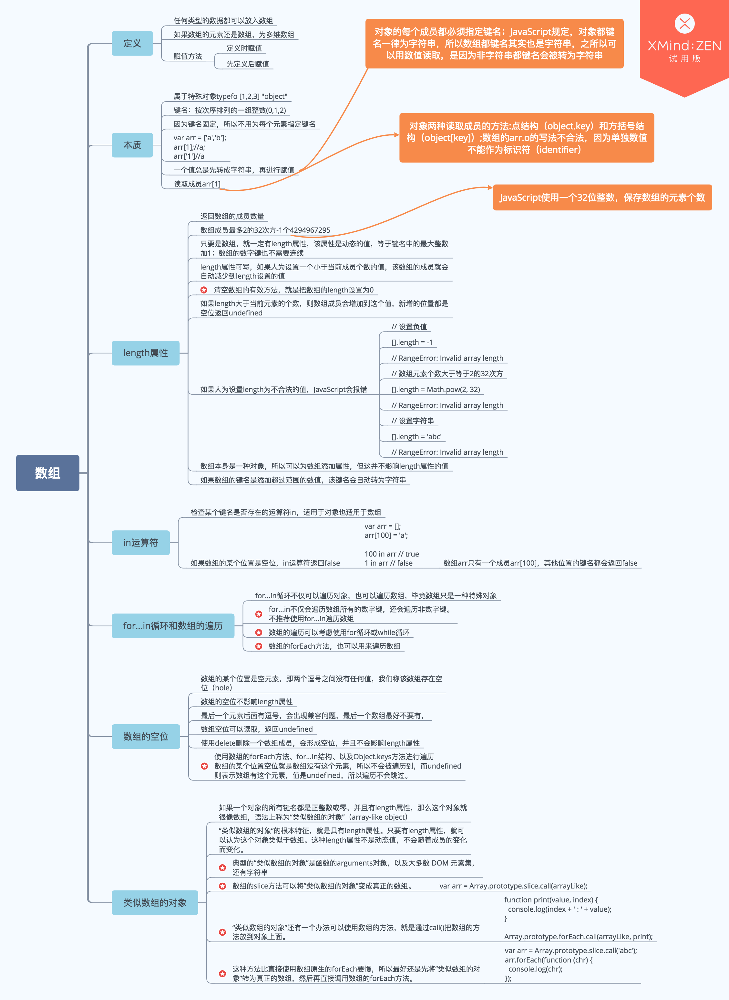

# Array



## concat() 方法用于连接两个或多个数组。

该方法不会改变现有的数组，返回一个新数组
```js
arrayObject.concat(arrayX,arrayX,......,arrayX)
```
arrayX 必需。该参数可以是具体的值，也可以是数组对象。可以是任意多个。

### 把两个排好序的数组合并成一个，并且按照从小到大的方式排列
```JS
var a = [1,3,5,7,13]
var b = [0,2,3,4,6,7,8,12]
c = b.concat(a)
c.sort(function(a,b){return a-b})
```

## 如果数组成员是undefined或null或空位，会被转成空字符串。
```js
[undefined, null].join('#')
// '#'

['a',, 'b'].join('-')
// 'a--b'
```


## 通过call方法，这个方法也可以用于字符串或类似数组的对象。
```js
Array.prototype.join.call('hello', '-')
// "h-e-l-l-o"

var obj = { 0: 'a', 1: 'b', length: 2 };
Array.prototype.join.call(obj, '-')
// 'a-b'
```

## concat 如果数组成员包括对象，concat方法返回当前数组的一个浅拷贝。所谓“浅拷贝”，指的是新数组拷贝的是对象的引用。
```js
var obj = { a: 1 };
var oldArray = [obj];

var newArray = oldArray.concat();

obj.a = 2;
newArray[0].a // 2
```


上面代码中，原数组包含一个对象，concat方法生成的新数组包含这个对象的引用。所以，改变原对象以后，新数组跟着改变。

## slice(start, end),返回新数组，原数组保持不变

slice方法的一个重要应用，是将类似数组的对象转为真正的数组。
```js
Array.prototype.slice.call({ 0: 'a', 1: 'b', length: 2 })
// ['a', 'b']

Array.prototype.slice.call(document.querySelectorAll("div"));
Array.prototype.slice.call(arguments);
```


## splice()
splice方法用于删除原数组的一部分成员，并可以在删除的位置添加新的数组成员，返回值是被删除的元素。注意，该方法会改变原数组。

## map方法接受一个函数作为参数。该函数调用时，map方法向它传入三个参数：当前成员、当前位置和数组本身。
```js
[1, 2, 3].map(function(elem, index, arr) {
  return elem * index;
});
// [0, 2, 6]
```

map方法还可以接受第二个参数，用来绑定回调函数内部的this变量（详见《this 变量》一章）。
```js
var arr = ['a', 'b', 'c'];

[1, 2].map(function (e) {
  return this[e];
}, arr)
// ['b', 'c']
```


## forEach()
forEach方法与map方法很相似，也是对数组的所有成员依次执行参数函数。但是，forEach方法不返回值，只用来操作数据。这就是说，如果数组遍历的目的是为了得到返回值，那么使用map方法，否则使用forEach方法。
forEach的用法与map方法一致，参数是一个函数，该函数同样接受三个参数：当前值、当前位置、整个数组。
```js
function log(element, index, array) {
  console.log('[' + index + '] = ' + element);
}
[2, 5, 9].forEach(log);
// [0] = 2

```


## filter()
filter方法用于过滤数组成员，满足条件的成员组成一个新数组返回。
它的参数是一个函数，所有数组成员依次执行该函数，返回结果为true的成员组成一个新数组返回。该方法不会改变原数组。
```js
[1, 2, 3, 4, 5].filter(function (elem) {
  return (elem > 3);
})
// [4, 5]
```

## some()1个满足，返回true
## every() 所有都满足，返回true
返回boolean值
## indexOf()，lastIndexOf()
indexOf方法返回给定元素在数组中第一次出现的位置，如果没有出现则返回-1。

## reduce
### 语法
```js
arr.reduce(callback,[initialValue])
```
reduce 为数组中的每一个元素依次执行回调函数，不包括数组中被删除或从未被赋值的元素，接受四个参数：初始值（或者上一次回调函数的返回值），当前元素值，当前索引，调用 reduce 的数组。

callback （执行数组中每个值的函数，包含四个参数）

1. previousValue （上一次调用回调返回的值，或者是提供的初始值（initialValue））
2. currentValue （数组中当前被处理的元素）
3. index （当前元素在数组中的索引）
4. array （调用 reduce 的数组）

initialValue （作为第一次调用 callback 的第一个参数。）
### 实例解析 initialValue 参数
先看第一个例子：
```js
var arr = [1, 2, 3, 4];
var sum = arr.reduce(function(prev, cur, index, arr) {
    console.log(prev, cur, index);
    return prev + cur;
})
console.log(arr, sum);
打印结果：
1 2 1
3 3 2
6 4 3
[1, 2, 3, 4] 10
```
这里可以看出，上面的例子index是从1开始的，第一次的prev的值是数组的第一个值。数组长度是4，但是reduce函数循环3次。

再看第二个例子：
```js
var  arr = [1, 2, 3, 4];
var sum = arr.reduce(function(prev, cur, index, arr) {
    console.log(prev, cur, index);
    return prev + cur;
}，0) //注意这里设置了初始值
console.log(arr, sum);
打印结果：
0 1 0
1 2 1
3 3 2
6 4 3
[1, 2, 3, 4] 10
```

这个例子index是从0开始的，第一次的prev的值是我们设置的初始值0，数组长度是4，reduce函数循环4次。

结论：如果没有提供initialValue，reduce 会从索引1的地方开始执行 callback 方法，跳过第一个索引。如果提供initialValue，从索引0开始。

注意：如果这个数组为空，运用reduce是什么情况？
```js
var  arr = [];
var sum = arr.reduce(function(prev, cur, index, arr) {
    console.log(prev, cur, index);
    return prev + cur;
})
//报错，"TypeError: Reduce of empty array with no initial value"
// 但是要是我们设置了初始值就不会报错，如下：

var  arr = [];
var sum = arr.reduce(function(prev, cur, index, arr) {
    console.log(prev, cur, index);
    return prev + cur;
}，0)
console.log(arr, sum); // [] 0
```
所以一般来说我们提供初始值通常更安全

### reduce的简单用法
当然最简单的就是我们常用的数组求和，求乘积了。
```js
var  arr = [1, 2, 3, 4];
var sum = arr.reduce((x,y)=>x+y)
var mul = arr.reduce((x,y)=>x*y)
console.log( sum ); //求和，10
console.log( mul ); //求乘积，24
```
### reduce的高级用法
（1）计算数组中每个元素出现的次数
```js
let names = ['Alice', 'Bob', 'Tiff', 'Bruce', 'Alice'];

let nameNum = names.reduce((pre,cur)=>{
  if(cur in pre){
    pre[cur]++
  }else{
    pre[cur] = 1 
  }
  return pre
},{})
console.log(nameNum); //{Alice: 2, Bob: 1, Tiff: 1, Bruce: 1}
```
（2）数组去重
```js
let arr = [1,2,3,4,4,1]
let newArr = arr.reduce((pre,cur)=>{
    if(!pre.includes(cur)){
      return pre.concat(cur)
    }else{
      return pre
    }
},[])
console.log(newArr);// [1, 2, 3, 4]
```
（3）将二维数组转化为一维
```js
let arr = [[0, 1], [2, 3], [4, 5]]
let newArr = arr.reduce((pre,cur)=>{
    return pre.concat(cur)
},[])
console.log(newArr); // [0, 1, 2, 3, 4, 5]
```
（3）将多维数组转化为一维
```js
let arr = [[0, 1], [2, 3], [4,[5,6,7]]]
const newArr = function(arr){
   return arr.reduce((pre,cur)=>pre.concat(Array.isArray(cur)?newArr(cur):cur),[])
}
console.log(newArr(arr)); //[0, 1, 2, 3, 4, 5, 6, 7]
```
（4）、对象里的属性求和

```js
var result = [
    {
        subject: 'math',
        score: 10
    },
    {
        subject: 'chinese',
        score: 20
    },
    {
        subject: 'english',
        score: 30
    }
];

var sum = result.reduce(function(prev, cur) {
    return cur.score + prev;
}, 0);
console.log(sum) //60
```
