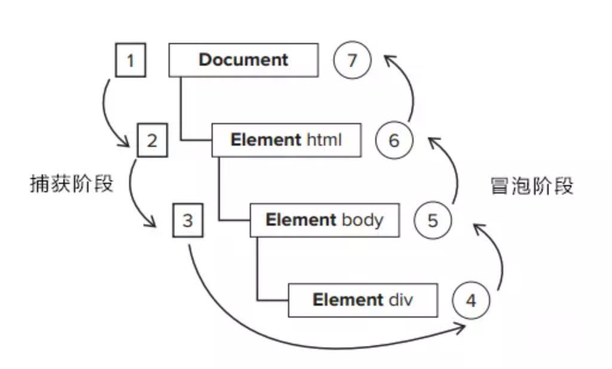

# 前端事件流

* 参考《JavaScript高级程序设计第三版》


先来一段书里的原文：

> 当浏览器发展到第四代时（IE4和Netscape Communicator 4）,浏览器团队遇到一个很有意思的问题：页面的哪一部分会拥有特定的事件？想象下在一张纸上有一组同心圆，如果你把手指放在圆心上，那么你的手指指向的不是一个圆，而是一组圆。两家公司的开发团队在看待浏览器事件方面还是一致的。如果你单击了某个按钮，那么同时你也单击了按钮的容器元素，甚至整个页面。

事件流描述的是从页面中接收事件的顺序。但有意思的是，IE和Netscape开发团队居然提出了两个截然相反的事件流概念。

1. IE的事件流是 事件冒泡流，
2. 标准的浏览器事件流是 事件捕获流。

不过addEventLister给出了第三个参数同时支持冒泡与捕获，下文将介绍

## 事件冒泡（dubbed  bubbling）
ie 的事件流叫事件冒泡，也就是说事件的传播为：从事件开始的具体元素，一级级往上传播到较为不具体的节点。案例见[event_flow.html](./html/event_flow.html)

当我们点击P元素时，事件是这样传播的：

(1) p

(2) div

(3) body

(4) html

(5) document

现代浏览器都支持事件冒泡，IE9、Firefox、Chrome和Safari则将事件一直冒泡到window对象。

## 事件捕获（event  capturing）
   Netscape团队提出的另一种事件流叫做事件捕获。它的原理刚好和事件冒泡相反，它的用意在于在事件到达预定目标之前捕获它，而最具体的节点应该是最后才接收到事件的。

比如还是上面的案例，当点击P元素时，事件的传播方向就变成了这样：

(1) document

(2) html

(3) body

(4) div

(5) p

IE9、Firefox、Chrome和Safari目前也支持这种事件流模型，但是有些老版本的浏览器不支持，所以很少人使用事件捕获，而是用事件冒泡的多一点。

## DOM事件流
"DOM2级事件"规定的事件流包括三个阶段：事件捕获阶段、处于目标阶段、事件冒泡阶段。

首先发生的事件捕获，为截获事件提供机会。然后是实际的目标接受事件。最后一个阶段是时间冒泡阶段，可以在这个阶段对事件做出响应。以前面的例子，则会按下图顺序触发事件。


图1-1（图片来源于课本，所以没有上面案例的p标签）

在DOM事件流中，事件的目标在捕获阶段不会接收到事件。这意味着在捕获阶段，事件从document到p后就停止了。

下一个阶段是处于目标阶段，于是事件在p上发生，并在事件处理中被看成冒泡阶段的一部分。然后，冒泡阶段发生，事件又传播回document。

多数支持DOM事件流的浏览器都实现了一种特定的行为；即使“DOM2级事件”规范明确要求捕获阶段不会涉及事件目标，但IE9、Safari、Chrome、Firefox和Opera9.5及更高版本都会在捕获阶段触发事件对象上的事件。结果，就是有两个机会在目标对象上操作事件

## 事件处理程序

事件就是用户或者浏览器自身执行某种动作，如click、load、mouseover。都是事件的名字。
而响应某个事件的函数就叫做事件处理程序（事件监听器），事件处理程序的名字以on开头，click=>onclick、load=>onload

DOM2提供了两个方法来让我们处理和删除事件处理程序的操作：addEventListener()和removeEventListener
```js
btn.addEventListener(eventType, function () {
}, false);
```
该方法应用至dom节点
* 第一个参数为事件名
* 第二个为事件处理程序
* 第三个为布尔值，true为事件捕获阶段调用事件处理程序，false为事件冒泡阶段调用事件处理程序

使用例子如下：
```js
 var btn = document.getElementById('btn');
 btn.addEventListener('click', function () {
             alert('事件捕获');
        }, true);
 btn.addEventListener('click', function () {
            alert('事件冒泡');
        }, false);
 ```
依次弹出“事件捕获”和“事件冒泡”，在这里的第一反应就是，他们有先后顺序吗？

于是我反过来写：
```js
  var btn = document.getElementById('btn');
  btn.addEventListener('click', function () {
            alert('事件冒泡');
        }, false);
  btn.addEventListener('click', function () {
             alert('事件捕获');
        }, true);
```
依次弹出的是：“事件冒泡”和“事件捕获”；到底有没有先后顺序呢？继续往下走

这次是这样的写法：[demo](./html/event_flow2.html)


当点击“我是子元素” 时，弹出的顺序是：“父级捕获”--》“子级冒泡”--》“子集捕获”--》“父集冒泡”；

这里可以说明，当点击子元素时，父级的执行顺序是先捕获，后冒泡的。

综合前面的代码，我们可以得出一个小小的结论：
   当容器元素及嵌套元素，即在捕获阶段又在冒泡阶段调用事件处理程序时：事件按DOM事件流的顺序执行事件处理程序，也就是如图1-1所示

　　且当事件处于目标阶段时，事件调用顺序决定于绑定事件的书写顺序，按上面的例子为，先调用冒泡阶段的事件处理程序，再调用捕获阶段的事件处理程序。依次alert出“子集冒泡”，“子集捕获”。

删除一个事件处理程序，用removeEventListener。例：
```js
var btn=document.getElementById('myBtn');
var myFn=function(){
    alert(this.id);
}
btn.addEventListener('click',myFn,false);
btn.removeEventListener('click',myFn,false);
```
**注意点：为了最大限度的兼容，大多是情况下都是将事件处理程序添加到事件冒泡阶段。不是特别需要，不建议在事件捕获阶段注册事件处理程序**

## 兼容ie浏览器写法：
* ie添加和删除事件处理程序的写法有点小区别，所以用以下代码可以做个兼容性处理：
* addEventListener在 IE11、Chrome 、Firefox、Safari等浏览器都得到支持。
* attachEvent主要用于IE浏览器，并且仅在IE10及以下才支持，IE11已经废了这个方法了
```js
var EventUtil = {
    addHandler: function (el, type, handler) {
        if (el.addEventListener) {
            el.addEventListener(type, handler, false);
        } else {
            el.attachEvent('on' + type, handler);
        }
    },
    removeHandler: function (el, type, handler) {
        if (el.removeEventListener) {
            el.removeEventListerner(type, handler, false);
        } else {
            el.detachEvent('on' + type, handler);
        }
    }
};
```
用法和前面的类似：

```js
EventUtil.addHandler('btn','click',handler);
```
## 事件对象

触发dom上的某个事件时，会产生一个事件对象，里面包含着所有和事件有关的信息。
兼容dom的浏览器会将一个event对象传到事件处理程序中

```js
btn.addEventListener("click",function(e){
            console.log(e);
        },false)

        btn.onclick = function(e){
            console.log(e);
        };
```
比较常用的有以下几个：非ie

|属性|类型|读写|说明|
|:---|:----|:---|:---|
|currentTarget| Element|只读|事件处理程序当前正在处理事件的那个元素（始终等于this）|
|preventDefault()|Function|只读 | 取消事件默认行为,比如链接的跳转|
|stopPropagation()|Function|只读 |取消事件冒泡|
|target|Element|只读 | 事件的目标|

* ie
```js
btn.onclick = function(){
    var e = window.event;
    console.log(e);
};
btn.attachEvent("onclick",function(e){
    console.log(e)
})
```
### ie主要几个属性

|属性/方法|类型|读写|说明|
|:----:|:---|:---|:---|
|cancelBubble|boolean|读/写|默认值为false，但将其设置为true就可以取消事件（和dom中的stopPropagation()方法作用相同）|
|returnValue|boolean|读写|默认值为true，但将其设置为false就可以取消事件默认行为（跟dom中的preventDefault()方法的作用相同）|
|srcElement|element|只读|事件的目标（雷同dom中的target）|
|type|String|只读|被触发的事件的类型|兼容ie的事件对象|

* 在事件处理程序中（dom中），srcElemet属性等于this，但是attachEvent this指向的是window;
* returnValue属性相当于DOM中的preventDefault()方法，能取消事件的默认行为。在ie中，只要将returnValue设置成false，就可以组织默认行为了


```js
var EventUtil = {
    addHandler: function (el, type, handler) {
        if (el.addEventListener) {
            el.addEventListener(type, handler, false);
        } else if (el.attachEvent) {
            el.attachEvent('on' + type, handler);
        } else {
            el['on' + type] = handler;
        }
    },
    removeHandler: function (el, type, handler) {
        if (el.removeEventListener) {
            el.removeEventListerner(type, handler, false);
        } else if (el.detachEvent) {
            el.detachEvent('on' + type, handler);
        } else {
            el['on' + type] = null;
        }
    },
    getEvent: function (e) {
        return e ? e : window.event;
    },
    getTarget: function (e) {
        return e.target ? e.target : e.srcElement;
    },
    preventDefault: function (e) {
        if (e.preventDefault) {
            e.preventDefault();
        } else {
            e.returnValue = false;
        }
    },
    stopPropagation: function (e) {
        if (e.stopPropagation) {
            e.stopPropagation();
        } else {
            e.cancelBubble = true;
        }
    }
};
```
## 其他

### html5事件之 beforeunload

* 在页面卸载前触发，就像编辑博客园文章未保存是弹出的提示框一样。

### html5事件之 DOMContentLoaded事件

页面文档完全加载并解析完毕之后,会触发DOMContentLoaded事件，HTML文档不会等待样式文件,图片文件,子框架页面的加载
```js
document.addEventListener('DOMContentLoaded',function(){
    console.log('3 seconds passed');
});
```
### html5事件之 hashchange事件

该事件当URL中的hash值改变时触发, 通常用于Ajax应用中利用URL参数保存导航信息;这个在前端路由的制作中是非常有用得

### html5事件之 contextmenu事件

这个事件是当鼠标右击的时候触发的，但是触发这个属性的时候默认的行为也会被触发，所以需要通过preventDefault()方法来阻止

### 事件委托：
   委托在JQuery中已经得到了实现，即通过$(selector).on(event,childSelector,data,function,map)实现委托，一般用于动态生成的元素，当然JQuery也是通过原声的js去实现的

   每个函数都是对象，都会占用内存，内存中的对象越多，性能就越差。对事件处理程序过多问题的解决方案就是事件委托。

   事件委托利用事件冒泡，只指定一个事件处理程序即可，就可以管理某一个类型的所有事件。例如：

有三个child,都需要一个click事件，此时不需要给每个li都绑定click事件，主要给他的父级 增加一个绑定事件即可。这样点击child，利用冒泡，直接触发parent的click，只要判断是哪个li的id

点击即可。而不需要三个child都绑定click事件。详见[事件委托](./html/event_flow.html)

