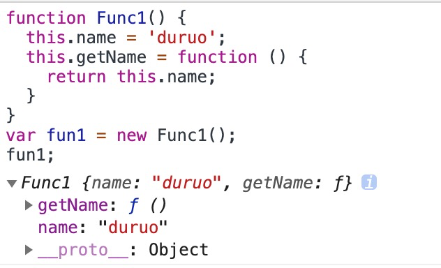
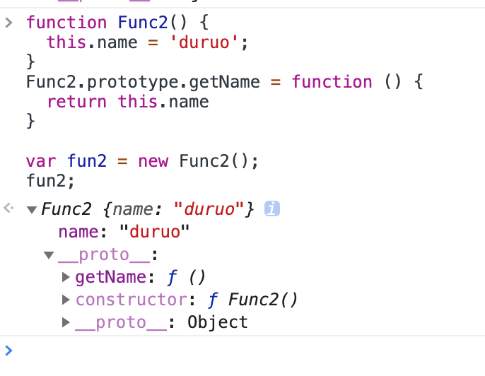

### 检测下拉到底部

        $(document).ready(function() {
          var nScrollHight = 0; //滚动距离总长
          var nScrollTop = 20;   //滚动到的当前位置
          var nDivHight = 500;
          $(".company-comment-list").scroll(function(){
            nScrollHight = $(this)[0].scrollHeight;
            nScrollTop = $(this)[0].scrollTop;

            if(nScrollTop + nDivHight >= nScrollHight)
              alert("滚动条到底部了");
          });
        });

### js构造函数里的方法和prototype上定义方法的区别

```
function Func1() {
  this.name = 'duruo';
  this.getName = function () {
    return this.name;
  }
}
var fun1 = new Func1();
fun1;

```


```
function Func2() {
  this.name = 'duruo';
}
Func2.prototype.getName = function () {
  return this.name
}

var fun2 = new Func2();
fun2;
```



两者区别
1. 构造函数内的方法在构造函数内，prototype上的方法在原型链上；
2. prototype上的变量和方法是不被序列化的`(对象序列化是指将对象的状态转换为字符串)`
3. 不加.prototype的话, 每一个对象都会拥有该方法的一份拷贝,造成内存浪费,加上.prototype可以保证所有实例对象共享一份方法


