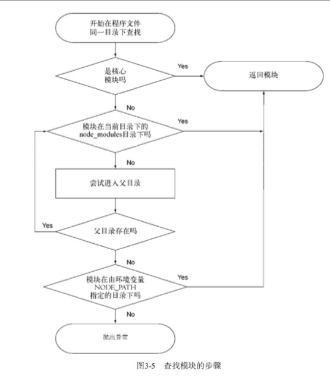
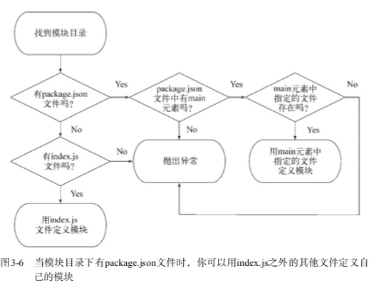
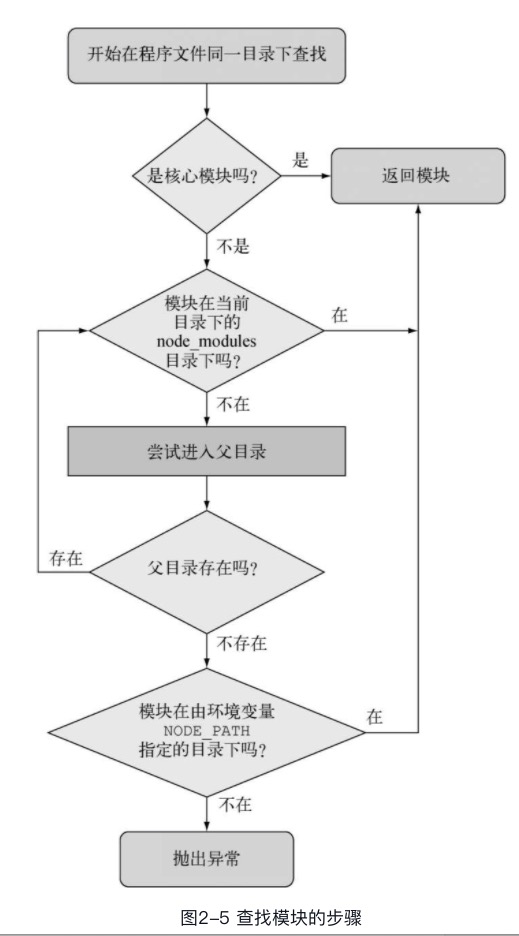

## mime.lookup 报错
错误如下： `mime.lookup is not a function`
* 原因是：mime 2.x.x 版本修改了函数名 为`mime.getType()`

引申： mime.getType()为响应或设置node的`Content-Type`的头，即设定文件类型
```js
const mime = require('mime');
 
mime.getType('txt');                    // ⇨ 'text/plain' 使用mime模块查询文件的MIME类型：
mime.getExtension('text/plain');        // ⇨ 'txt' 查询文件护展名mime.getExtension(type)
```

## 用node_modules中用模块
如果用require('hello')，node会尊照规则搜寻这个模块，如下图


* 用环境变量NODE_PATH 可以改变 Node 模块默认路径。如果用了它，NODE_PATH 在windows中应该设置为用分号分隔目录列表，在其他操作系统中用冒号分割

* 注意事项
1. 如果模块是目录，在模块目录中定义模块但文件必须被命名为index.js，除非你在这个目录下一个叫`package.json`的文件里特别知名。要指定一个取代index.js 的文件， package.json 文件里必须有一个 JavaScript 对象表示法（json）数据定义的对象，其中有一个名为main的键，指明模块目录内主文件的路径。
如下图所示


2. Node 能把模块作为对象缓存起来。如果程序中的两个文件引入了相同的模块，第一个文件会把模块返回的数据存在程序的内存中。这样第二个文件就不会再去访问和计算模块的源文件了。实际上第二个引入有机会修改缓存的数据。这种“猴子布丁”（monkey patching）让一个模块可以改变另一个模块的行为，开发人员可以不用创建它的新版本。

## node 查找模块的步骤


node.js实战 2.5